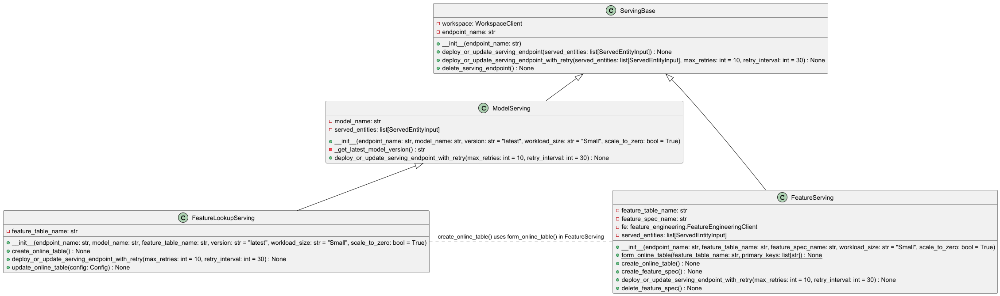

<h1 align="center">
Marvelous MLOps End-to-end MLOps with Databricks course

## Practical information
- Weekly lectures on Wednesdays 16:00-18:00 CET.
- Code for the lecture is shared before the lecture.
- Presentation and lecture materials are shared right after the lecture.
- Video of the lecture is uploaded within 24 hours after the lecture.

- Every week we set up a deliverable, and you implement it with your own dataset.
- To submit the deliverable, create a feature branch in that repository, and a PR to main branch. The code can be merged after we review & approve & CI pipeline runs successfully.
- The deliverables can be submitted with a delay (for example, lecture 1 & 2 together), but we expect you to finish all assignments for the course before the 25th of November.


## Set up your environment
In this course, we use Databricks 15.4 LTS runtime, which uses Python 3.11.
In our examples, we use UV. Check out the documentation on how to install it: https://docs.astral.sh/uv/getting-started/installation/

To create a new environment and create a lockfile, run:

```
uv venv -p 3.11 venv
source venv/bin/activate
uv pip install -r pyproject.toml --all-extras
uv lock
```

## Modules
### Data Ingestion (DataLoader)
 `DataLoader` class is designed for cleaning and processing hotel reservation data using PySpark and pandas. Here's a summary of its key features and functionality:

1. Data Loading: The class can load data from CSV files, supporting both local file systems and Databricks environments.

2. Data Validation: It includes methods to validate required columns, data types, and check for null values in the dataset.

3. Data Preprocessing: The class offers various data cleaning operations such as:
   - Renaming columns based on configuration
   - Converting and validation column data types
   - Applying value corrections (e.g., mapping categorical values to numeric ones)
   - Normalizing arrival dates
   - Performing final quality checks on the data

4. Data Splitting: It provides functionality to split the data into training and testing sets, as well as extracting non-online market segment data.

5. Data Saving: For Databricks environments, it includes methods to save processed data to a catalog, creating tables with timestamps and enabling change data feed.

6. Logging and Error Handling: The code extensively uses logging to track the data processing steps and implements error handling for various scenarios.

7. Configuration: The class uses a configuration object to manage settings for features, target variables, and data types.

Overall, it is a comprehensive data preparation pipeline for hotel reservation data, emphasizing data quality, flexibility, and compatibility with both local and cloud-based (Databricks) environments.

### Model Training & Registration

#### `Basic Model`

*   The `BasicModel` class provides a foundational framework for building and deploying machine learning models, specifically tailored for the Databricks environment using MLflow for experiment tracking, model management, and deployment. It encapsulates the essential steps of a machine learning workflow, from data loading and preprocessing to model training, evaluation, and registration within Unity Catalog (UC).

*   **Key Features:**

    *   **Data Loading:** Facilitates loading training and testing datasets directly from Databricks tables, leveraging Spark for efficient data handling and conversion to Pandas DataFrames.
    *   **Feature Engineering:** Incorporates a preprocessing pipeline using `scikit-learn's` `ColumnTransformer` and `OneHotEncoder` to handle categorical features effectively, ensuring compatibility with machine learning algorithms.
    *   **Model Training:** Supports training of `LGBMClassifier` models (or any `scikit-learn`-compatible model) using a defined pipeline, streamlining the training process.
    *   **MLflow Integration:** Seamlessly integrates with MLflow to log model parameters, metrics (accuracy, AUC, classification reports), and artifacts, enabling comprehensive experiment tracking and reproducibility. It also logs the training dataset as an MLflow input, capturing its name and version.
    *   **Model Registration:** Automates the registration of trained models in Unity Catalog, assigning aliases (e.g., "latest-model") for easy retrieval and deployment of the most recent version.
    *   **Model Deployment:** Includes functionality to load the latest registered model from MLflow and generate predictions on new data, facilitating model serving and inference.
    *   **Configuration-Driven:** Designed to be highly configurable through a `Config` class, allowing users to specify model parameters, feature lists, target variables, and MLflow settings via configuration files.
    *   **Databricks-Centric:** Optimized for use within Databricks environments, with specific checks and utilities (e.g., `is_databricks()`, `get_delta_table_version()`, `get_current_git_sha()`) to ensure compatibility and leverage Databricks features.

*   **Workflow:** The module orchestrates a typical machine learning workflow: loading data from Databricks tables, preprocessing features, training a model, logging model metadata and performance to MLflow, registering the model in Unity Catalog, and providing a means to load and apply the latest registered model for inference.

*   **Use Case:** Ideal for projects requiring a standardized and repeatable machine learning pipeline within Databricks, with a focus on experiment tracking, model governance, and simplified deployment through MLflow and Unity Catalog.

#### `Custom Model`

*   The `CustomModel` module provides a flexible framework for integrating arbitrary pre-trained machine learning models into an MLflow workflow, particularly within a Databricks environment, leveraging Unity Catalog (UC) for model governance. It's designed to handle models that might not be directly supported by MLflow's built-in logging functions, allowing you to wrap and deploy models created using any library.

*   **Key Features:**

    *   **Model Wrapping:** Employs a `ModelWrapper` class that extends `mlflow.pyfunc.PythonModel`, providing a standardized `predict` interface for any underlying model, regardless of its original framework.  This allows MLflow to treat the custom model as a standard Python function.
    *   **Serialization:**  Uses `cloudpickle` for serializing and deserializing the underlying model.  This allows for handling a wider variety of model types than standard pickle.
    *   **Code Dependency Management:**  Handles code dependencies by allowing you to specify a list of `code_paths` (e.g., paths to `.whl` files). These dependencies are included in the MLflow environment, ensuring that the model can be loaded and executed correctly.
    *   **MLflow Integration:** Seamlessly integrates with MLflow to log the wrapped model, including its signature, input examples, and environment.  It leverages `mlflow.pyfunc.log_model` for this.
    *   **Model Registration:** Automates the registration of trained models in Unity Catalog, assigning aliases (e.g., "latest-model") for easy retrieval and deployment of the most recent version.
    *   **Model Deployment:** Includes functionality to load the latest registered model from MLflow and generate predictions on new data, facilitating model serving and inference.
    *   **Configuration-Driven:** Designed to be highly configurable through a `Config` class, allowing users to specify model parameters, feature lists, target variables, and MLflow settings via configuration files.
    *   **Custom Environment:**  Creates a custom Conda environment for the model, including necessary dependencies like `pyspark` and any additional packages specified through `code_paths`.
    *   **Flexibility:** Enables the deployment of models trained using any Python-compatible machine learning library, overcoming limitations of MLflow's autologging for specific frameworks.

*   **Workflow:** The module encapsulates the process of wrapping a pre-trained model, defining its dependencies, logging it to MLflow, registering it in Unity Catalog, and deploying it for inference.  It allows you to bring your own model and integrate it into a managed MLflow environment.

*   **Use Case:** Ideal for scenarios where you have a pre-trained model (e.g., a model trained outside of Databricks or using a less common library) that you want to deploy and manage within the Databricks ecosystem using MLflow and Unity Catalog.  It provides a way to standardize the deployment process for diverse model types.

####  `FeatureLookUpModel model`

*   The `FeatureLookUpModel` class provides an advanced approach to machine learning for hotel reservation prediction by leveraging Databricks Feature Engineering Client for feature creation and management, in addition to MLflow for experiment tracking and model deployment. This class uses Feature Engineering to create and manage features used by the model.
*   **Key Features:**

    *   **Feature Engineering with Databricks Feature Engineering Client:** Uses the Databricks Feature Engineering Client to create and manage feature tables and functions within the Databricks environment.
    *   **Feature Lookup:** Utilizes `FeatureLookup` to dynamically enrich training data with features from managed feature tables, ensuring data consistency and reducing feature engineering boilerplate.
    *   **Automated Feature Table Creation:** Automatically creates and populates feature tables (e.g., `hotel_features`) within Unity Catalog, simplifying the feature engineering process.
    *   **Feature Function Definition:** Enables the creation and registration of custom feature functions (e.g., calculating lead time) as SQL functions within Databricks, promoting code reuse and simplifying feature transformations.
    *   **MLflow Integration:** Integrates with MLflow to log model parameters, metrics (accuracy, AUC, classification reports), and the trained model, ensuring comprehensive experiment tracking and reproducibility.
    *   **Model Training:** Trains an `LGBMClassifier` model (configurable via `config.parameters`) using a `scikit-learn` Pipeline, simplifying the training process.
    *   **Model Registration:** Registers the trained model in Unity Catalog, enabling versioning and easy deployment, similar to the `BasicModel`.
    *   **Databricks-Centric:** Designed specifically for Databricks environments, leveraging the Feature Engineering Client, Spark for data handling, and Unity Catalog for model and feature governance.
*   **Workflow:**  The module orchestrates a feature-rich machine learning pipeline: creating feature tables and functions, loading data and enriching it with Feature Lookups, training an LGBMClassifier model, logging metadata and performance to MLflow, and registering the model in Unity Catalog.
*   **Use Case:**  Well-suited for projects that require advanced feature engineering capabilities, such as feature sharing, feature reuse, and automated feature management within Databricks. It's ideal for scenarios where feature tables are managed separately and need to be dynamically joined with training data.


### Model Serving Architectures



### `ServingBase` Module

*   The **`ServingBase`** class provides a foundational abstraction for managing Databricks Model Serving endpoints. It encapsulates the core logic for deploying, updating, and deleting serving endpoints through the Databricks SDK, offering a simplified interface for endpoint management. This base class ensures reliable and robust endpoint operations.
*   **Key Features:**

    *   **Databricks SDK Integration:** Leverages the Databricks SDK to interact with the Databricks Model Serving API, simplifying endpoint creation and management within a Databricks workspace.
    *   **Endpoint Deployment and Updates:** Offers methods to deploy new serving endpoints or update existing ones, handling the underlying API calls and configuration management.
    *   **Conflict Resolution with Retry Mechanism:** Includes a robust retry mechanism to handle resource conflicts that may occur during endpoint updates. This ensures endpoint deployment even under concurrent update attempts.
    *   **Error Handling:** Provides error handling for common serving endpoint operations such as deletion.
    *   **Workspace Client Initialization:** Automatically initializes the Databricks Workspace client for seamless interaction with the Databricks environment.
*   **Workflow:** The module simplifies the process of managing Databricks serving endpoints, handling the complexities of the Databricks SDK and implementing best practices for robust deployment.
*   **Use Case:** The `ServingBase` class serves as a base class for all types of serving configurations making it easy to deploy and manage serving endpoints in Databricks. It provides a centralized approach for deployment and management.


####  `ModelServing` Module

*   The **`ModelServing`** class extends the `ServingBase` class, providing a specialized solution for deploying and managing MLflow model serving endpoints within Databricks. It simplifies the process of serving registered models, particularly those produced by the `BasicModel` and `FeatureLookUpModel` classes, and leverages the established endpoint management capabilities of `ServingBase`.
*   **Key Features:**

    *   **Model Deployment Specialization:** Provides a streamlined way to deploy registered models managed within MLflow and Unity Catalog as serving endpoints in Databricks.
    *   **Automated Version Retrieval:** Automatically retrieves the latest version of a registered model from MLflow using the "latest-model" alias, ensuring that the most up-to-date model is deployed.
    *   **Serving Endpoint Configuration:** Allows configuration of the serving endpoint's workload size and scaling behavior (scale-to-zero), optimizing resource utilization and cost efficiency.
    *   **ServingBase Integration:** Inherits deployment and update functionalities, including retry mechanisms, from the `ServingBase` class, providing a robust and reliable endpoint management foundation.
*   **Workflow:** The module automates the creation or updating of a Databricks serving endpoint for a specific MLflow model, retrieving the latest version, configuring the endpoint's resources, and deploying it using the `ServingBase` class.
*   **Use Case:** Ideal for scenarios where you need to deploy MLflow models (such as those trained using the `BasicModel` or `FeatureLookUpModel` classes) as real-time serving endpoints in Databricks. This class simplifies the deployment process, automates version management, and ensures reliable endpoint operation, making it easy to serve your machine learning models. It is generally used in tandem with the other modules mentioned to complete the lifecycle.


#### `FeatureServing` Module

*   The **`FeatureServing`** class, extending `ServingBase`, is designed to facilitate the serving of features created and managed using the Databricks Feature Engineering Client, specifically for real-time inference scenarios. It complements the `FeatureLookUpModel` by enabling the deployment of feature transformations and lookups as a managed serving endpoint, decoupling feature computation from model serving. This allows for consistent feature serving.
*   **Key Features:**
    *   **Feature Specification Management:** Creates and manages feature specifications using the Databricks Feature Engineering Client, defining the features to be served.
    *   **Online Table Creation:** Automatically creates online feature tables from offline feature tables, making features available for low-latency access during inference, with the features created by `FeatureLookUpModel`.
    *   **Databricks Serving Endpoint Deployment:** Deploys the feature specification as a Databricks serving endpoint, enabling real-time feature computation and serving. Leverages functionality of `ServingBase` class.
    *   **Integration with Databricks Feature Engineering Client:** Seamlessly integrates with the Databricks Feature Engineering Client for feature creation, management, and serving.
*   **Workflow:** The module automates the process of creating online tables, defining feature specifications, and deploying a serving endpoint for real-time feature access. It creates the online table from the existing offline feature table.
*   **Use Case:** Ideal for situations in which features from the Databricks Feature Store need to be served in real-time. The `FeatureServing` class is the tool to serve features for online use.

 #### `FeatureLookupServing` Module

*   The `FeatureLookupServing` class extends the `ModelServing` class to provide a streamlined approach for serving models that rely on feature lookups from online feature tables. It simplifies the process of creating and managing these online tables and deploying serving endpoints that incorporate real-time feature data, allowing the model to serve the most current information from the Feature Store created by the Databricks Feature Engineering Client.

*   **Key Features:**

    *   **Online Table Management:** Automates the creation of online feature tables from existing offline feature tables in Databricks, enabling low-latency access to features for real-time inference.
    *   **Feature Lookup Integration:** Designed to work seamlessly with models trained using features from Databricks Feature Store (as demonstrated in the `FeatureLookUpModel` class).
    *   **Model Serving with Real-time Features:** Deploys and manages serving endpoints that dynamically retrieve features from online tables during inference, ensuring the model uses the latest available data.
    *   **ServingBase and ModelServing Inheritance:** Inherits endpoint deployment, update, and retry functionalities from both `ServingBase` and `ModelServing`, providing a robust and reliable endpoint management foundation.

*   **Workflow:** The module simplifies the deployment of models (trained to use features created via Databricks Feature Engineering) by managing the process of creating the online feature tables and deploying the model with feature lookups.

*   **Use Case:** Ideal for deploying models trained using the Databricks Feature Engineering Client in real-time inference scenarios. This ensures that models have access to the freshest feature data, leading to more accurate and reliable predictions. It is used in cases where the feature table is updated frequently, and the model needs to respond to the newest feature values. The module can be used to quickly spin up the serving endpoint for the model.
